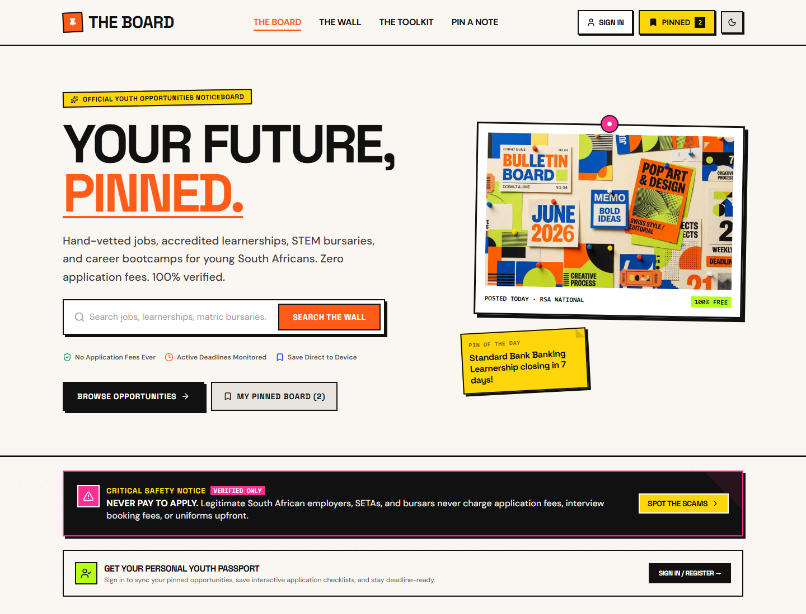

# The Board

**Your future, pinned.**

The Board is a responsive opportunities noticeboard for young South Africans. It brings jobs, learnerships, internships, bursaries, courses, and career events together in one searchable place, with practical tools to help applicants decide what to explore next.

## Preview



## What you can do

- Search opportunities and filter by category, location, deadline, experience, and education requirement.
- Explore opportunity details, eligibility information, deadlines, and application links.
- Save opportunities, track application checklists, and revisit recently viewed listings.
- Create a local profile, including options for applicants who have not completed Matric.
- Use career resources for CVs, interviews, cover letters, documents, and scam awareness.
- Switch to Night Board, use the contact forms, and navigate on mobile or desktop.

Saved items, profile details, theme, and checklist progress are stored in the browser using `localStorage`. Contact forms demonstrate the submission flow locally; they do not send messages to a server.

## Run locally

The project is a static website. It has no build step and requires no npm packages. Serve the project directory over HTTP so the site can load its templates and opportunity data.

With Python installed, run this from the project folder:

```powershell
py -m http.server 8000
```

Then open <http://localhost:8000>. If `py` is unavailable, use `python -m http.server 8000`.

## Project structure

```text
the-board/
├── assets/
│   └── images/
├── css/
│   ├── responsive.css
│   └── style.css
├── data/
│   └── opportunities.json
├── js/
│   └── script.js
├── templates/
├── index.html
└── README.md
```

## Built with

- HTML5
- CSS3
- Vanilla JavaScript
- Browser `localStorage`

Opportunity content is maintained in `data/opportunities.json`. Review each listing and its external application link before relying on it; always confirm current eligibility and deadlines with the organization offering it.
